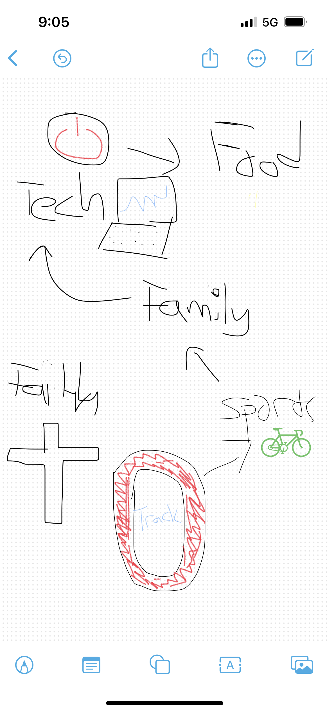
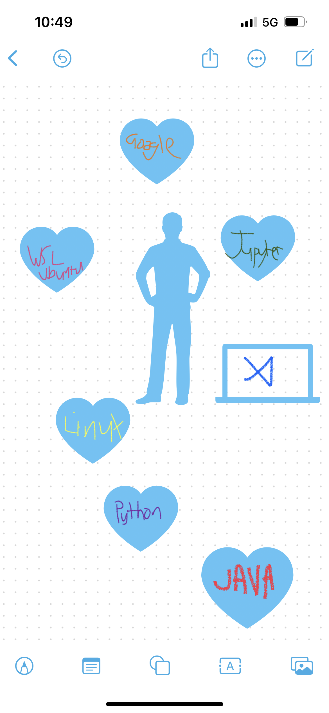

<html>

<body>
<h1>Welcome to Tay's CSA Blog</h1>

<p1>I am a junior at Del Norte High School. I am in period 1 Mort's CSA class.</p1>
 

    

        
        
About Me! Love playing sports (running) and hanging out with family and friends.

    

    

        
        
I Love My Tools! Super helpful - Google, VSCode, Java, Python, Jupyter, WSL, Ubuntu

    

    

        
        
IDK, cool image

    

 
<h1 style="margin-left: 40px">Class Schedule</h1>
</body>
<table border="1" style="text-align: center;">
    <tr>
        <th>Period</th>
        <th>Class</th>
        <th>Teacher</th>
    </tr>
    <tr>
        <td>1</td>
        <td>AP CSA</td>
        <td>Mr. Mortenson</td>
    </tr>
    <tr>
        <td>2</td>
        <td>AP Physics</td>
        <td>Mr. Liao</td>
    </tr>
    <tr>
        <td>3</td>
        <td>AP English Language</td>
        <td>Mrs. Darcey Hall</td>
    </tr>
    <tr>
        <td>4</td>
        <td>AP Calculus BC</td>
        <td>Mr. Bernabeo</td>
    </tr>
    <tr>
        <td>5</td>
        <td>Offroll</td>
        <td></td>
    </tr>
</table>
 
<h1>Calculator</h1>

    
0

    <button onclick="appendToDisplay('7')">7</button>
    <button onclick="appendToDisplay('8')">8</button>
    <button onclick="appendToDisplay('9')">9</button>
    <button onclick="appendToDisplay('+')">+</button> 
    <button onclick="appendToDisplay('4')">4</button>
    <button onclick="appendToDisplay('5')">5</button>
    <button onclick="appendToDisplay('6')">6</button>
    <button onclick="appendToDisplay('-')">-</button> 
    <button onclick="appendToDisplay('1')">1</button>
    <button onclick="appendToDisplay('2')">2</button>
    <button onclick="appendToDisplay('3')">3</button>
    <button onclick="appendToDisplay('*')">*</button> 
    <button onclick="appendToDisplay('0')">0</button>
    <button onclick="calculate()">=</button>
    <button onclick="clearDisplay()">C</button>
    <button onclick="appendToDisplay('/')">/</button>

</html>